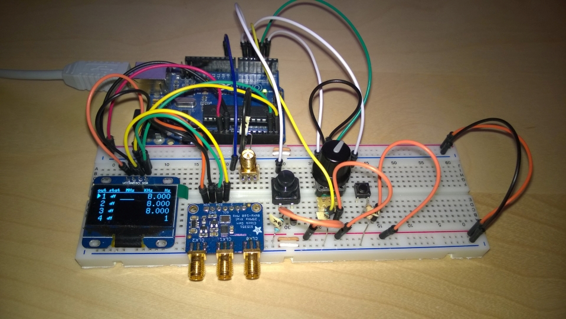
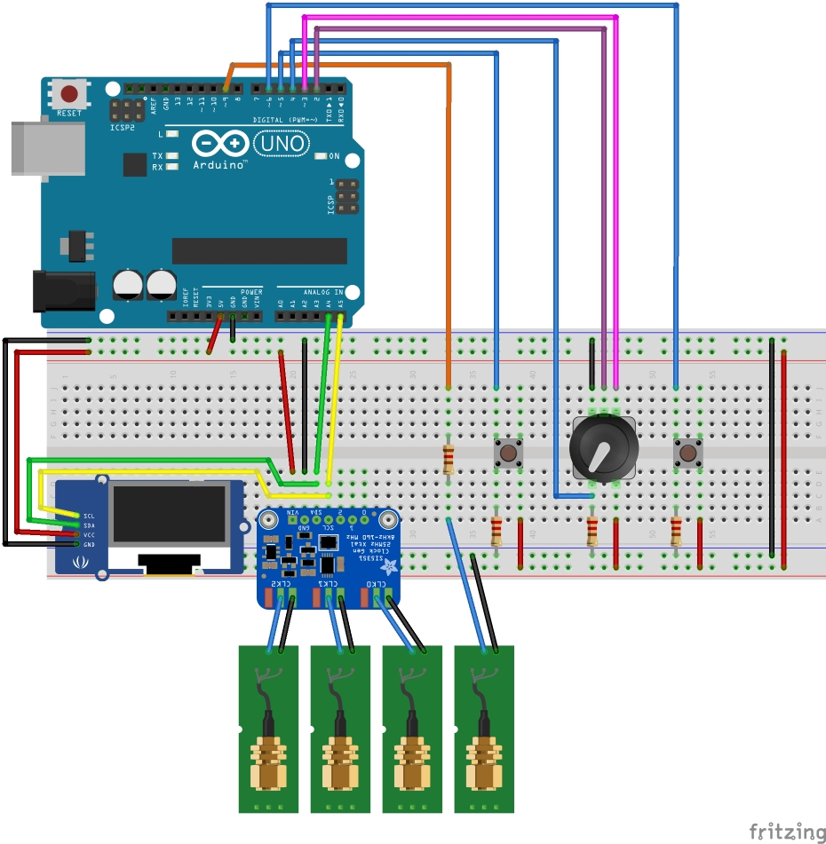

# Quad Frequency VFO / Clock Generator

This is a quad output variable frequency oscillator. It is based on the [Adafruit Si5351A Clock Generator Breakout Board](https://www.adafruit.com/products/2045).
The fourth output is a simple PWM pin driven by the TimerOne library.
The whole thing is controlled by an [Adruino](https://www.arduino.cc/) ([ATmega328](http://www.atmel.com/images/atmel-8271-8-bit-avr-microcontroller-atmega48a-48pa-88a-88pa-168a-168pa-328-328p_datasheet_complete.pdf)).

## Outputs
1. 8KHz to 160MHz
2. 8KHz to 160MHz
3. 8KHz to 160MHz
4. 0 to 10KHz

## Usage
* Short press on the big button cycles through the outputs 
* Long press on the big button enables/disables the current output
* Turning the knob will increase/decrease the value of the current output
* Short press of the knob will cycle through the positions of the current output  
* Long press of the knob will zero out the current position of the current output
* Pressing the small button will save the current settings (in the eeprom)
* If nothing is pressed for 10 minutes, a screensaver will appear

## Libraries used
* Jason Milldrum's Etherkit Si5351 library: [https://github.com/etherkit/Si5351Arduino](https://github.com/etherkit/Si5351Arduino)
* TimerOne library: [http://playground.arduino.cc/Code/Timer1](http://playground.arduino.cc/Code/Timer1)
* Oliver Kraus' u8g library: [https://github.com/olikraus/u8glib](https://github.com/olikraus/u8glib)
* Thomas O Fredericks' Bounce2 library: [https://github.com/thomasfredericks/Bounce2](https://github.com/thomasfredericks/Bounce2)

## Pictures
Assembled:

Breadboard:

[Fritzing](http://fritzing.org/home/):
